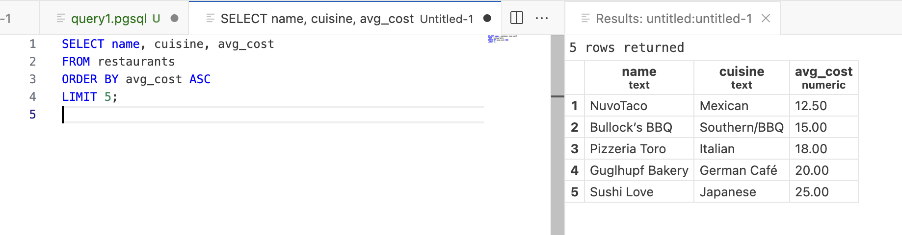
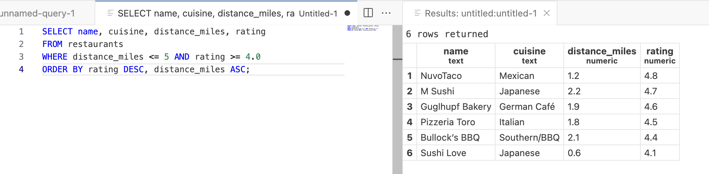
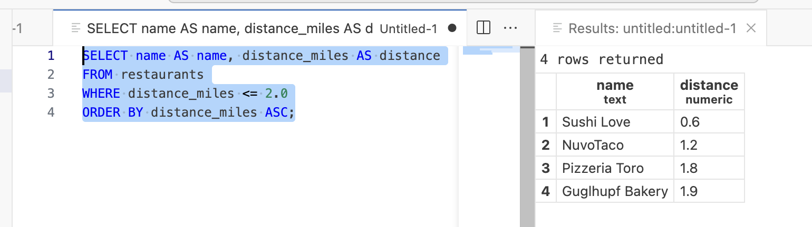
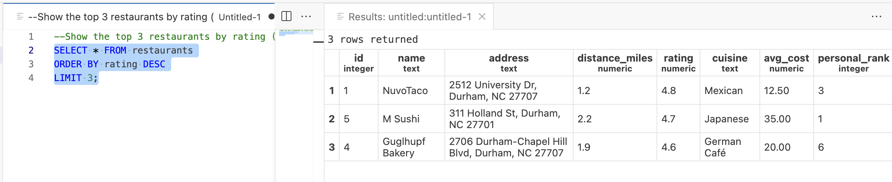
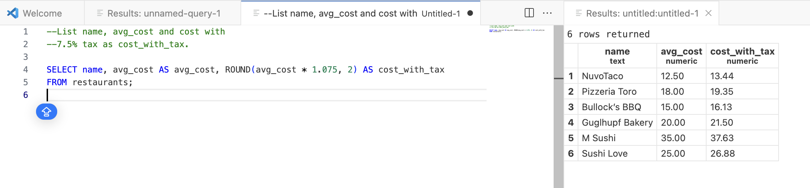
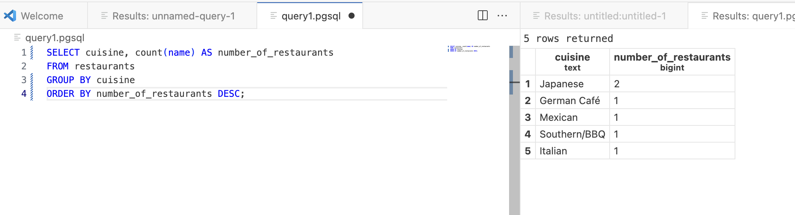

# IDS 706: Data Engineering Systems

Postgres Demonstration

See succesful execution of queries below.
1. What are the 5 cheapest restaurants based on avg_cost?
```sql
SELECT name, cuisine, avg_cost
FROM restaurants
ORDER BY avg_cost ASC
LIMIT 5;
```


2. Which nearby restaurants (within 5 miles) are highly rated (4.0+)?
```sql
SELECT name, cuisine, distance_miles, rating
FROM restaurants
WHERE distance_miles <= 5 AND rating >= 4.0
ORDER BY rating DESC, distance_miles ASC;
```



3. Return name, distance_miles for restaurants within 2.0 miles, ordered by distance.
```sql
SELECT name AS name, distance_miles AS distance
FROM restaurants
WHERE distance_miles <= 2.0
ORDER BY distance_miles ASC;
```


4. Show the top 3 restaurants by rating (highest first).
```sql
SELECT * FROM restaurants
ORDER BY rating DESC
LIMIT 3;
```


5. List name, avg_cost and cost with 7.5% tax as cost_with_tax.
```sql
SELECT name, avg_cost AS avg_cost, ROUND(avg_cost * 1.075, 2) AS cost_with_tax
FROM restaurants;
```


6. How many restaurants are there per cuisine, highest count first?
```sql
SELECT cuisine, count(name) AS number_of_restaurants
FROM restaurants
GROUP BY cuisine
ORDER BY number_of_restaurants DESC;
```

